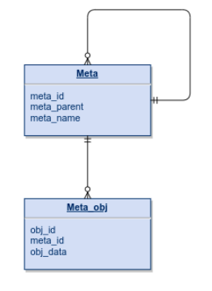

# A tale of two tables: How to optimize queries (part 1)

I hope you all found this challenge entertaining as I found. I will try to walk you through one of the process I like to use while trying to optimise a query. The **prologue** here isn't really needed to understand the process and it's more an attempt to entertain and to thank all involved in this challenge for the great time I had while reading the queries and understanding their ideas and what made them fast or what we could change on them to get them even faster. Enjoy the reading!

## Index
 - [Prologue](challenge1_analysis.md#prologue)
 - [Query analysis](challenge1_analysis.md#query-analysis)
    - [Query creation](challenge1_analysis.md#query-creation)
 - [References](challenge1_analysis.md#references)

## Prologue

> "It was the best of times, it was the worst of times, it was the age of wisdom, it was the age of foolishness, it was the epoch of belief, it was the epoch of incredulity, it was the season of Light, it was the season of Darkness, it was the spring of hope, it was the winter of despair
> <...>
> the period was so far like the present period, that some of its noisiest authorities insisted on its being received, for good or for evil, in the superlative degree of comparison only!" [1]

Once upon a time, a challenger proposed a task which was to join two tables: 



and create a summary report:

```
  meta_id | hierarchy_id  |        hierarchy_name         | meta_name | total 
---------+----------------+-------------------------------+-----------+-------
       1 | 1              | Meta 1                        | Meta 1    |     0
       2 | 2              | Meta 2                        | Meta 2    |     0
       3 | 3              | Meta 3                        | Meta 3    |     0
       4 | 2 -> 4         | Meta 2 -> Meta 4              | Meta 4    | 31166
       5 | 3 -> 5         | Meta 3 -> Meta 5              | Meta 5    | 62526
       6 | 1 -> 6         | Meta 1 -> Meta 6              | Meta 6    | 62661
       7 | 1 -> 7         | Meta 1 -> Meta 7              | Meta 7    | 62976
      10 | 2 -> 10        | Meta 2 -> Meta 10             | Meta 10   | 62280
      11 | 3 -> 11        | Meta 3 -> Meta 11             | Meta 11   | 62868
      12 | 1 -> 12        | Meta 1 -> Meta 12             | Meta 12   | 62319
      15 | 1 -> 15        | Meta 1 -> Meta 15             | Meta 15   | 62753
       8 | 2 -> 4  -> 8   | Meta 2 -> Meta 4  -> Meta 8   | Meta 8    | 62838
       9 | 1 -> 7  -> 9   | Meta 1 -> Meta 7  -> Meta 9   | Meta 9    | 62200
      13 | 2 -> 10 -> 13  | Meta 2 -> Meta 10 -> Meta 13  | Meta 13   | 62571
      14 | 2 -> 4  -> 14  | Meta 2 -> Meta 4  -> Meta 14  | Meta 14   | 62271
      16 | 3 -> 5  -> 16  | Meta 3 -> Meta 5  -> Meta 16  | Meta 16   | 62030
      17 | 1 -> 12 -> 17  | Meta 1 -> Meta 12 -> Meta 17  | Meta 17   | 62333
      18 | 2 -> 4  -> 18  | Meta 2 -> Meta 4  -> Meta 18  | Meta 18   | 62873
      19 | 2 -> 10 -> 19  | Meta 2 -> Meta 10 -> Meta 19  | Meta 19   | 62027
      20 | 1 -> 7  -> 20  | Meta 1 -> Meta 7  -> Meta 20  | Meta 20   | 31308
```

The problem is that one of the tables had an intriguing self-relationship, the other had hundreds of thousands of records, and the whole hierarchy needed to be exposed using one single query!

The mighty DBAs worked hard to come up with many different solutions but the challenger told them "**"- the result should be revealed in LESS than TWO seconds by the brave query**". It was devastating, was that even possible?

Those were dark times, there was no hope and humanity went into the shadows. We thought there was no solution! However, _coming from the far North_, a glorious query appears… She had the solution, and not only the solution but also hope! She didn't come alone, she brought with her a magnificent, brilliant, and powerful Index that gave her the power to perform the task in an impressive 80 milliseconds! We are saved!

The challenger yowled furiously, then he roared with laughter, and said that it wasn't enough. The query should not use any subterfuge and **an Index wouldn't be accepted**, and because of that insolent act, the challenge now is raised to less than a second. Any query that proposes **a solution shall execute in LESS THAN ONE second** without any external subterfuge! **That was the word, that was the law**!

The world went to darkness again. No magic selects were seen since that time. No one was brave enough to confront the challenger, there was hope! No more fast and ingenuous reports within one query, we were left with the multiple round trips fate, nothing more than multitudinous loops in the heart of our new applications, they are now born to ever contend with the database!

Time passed, major versions were released, applications moved to third-party solutions data analysts perished in ruin, and the era of the ORMs arrived...We believed no hope would ever come back, and it happened until that day. That was the day to remember, the day that THE marvelous **double CTE was raised**! It was unclear how that happened, it was unorthodox, neither the channels it took through the dark paths of social media, nor the usage of two CTEs was expected. People were at the same time perplexed, incredulous that such a thing could even exist, and euphoric with the possibility of the birth of a new time. Would it be really possible? Would we be able to once again rely on a query to solve that report? Would we finally defeat this cruel, implacable, and heartless challenger?

Tests were exhausted, restrictions imposed, datasets created, indexes measured… The challenger worked harder and harder to prove himself stronger and defeat the query but then, after that one last test, with the one last dataset, through numberless explains he surrendered! That one query, the one that broke the ordinary and didn't come through GitHub, thought unworthy, belittled… yes that same one defeated the challenger and brought us the hope, brought us the will and the means to finally be able to get our two tables reunited in an amazing report created by one single query, **a query that ran in 180ms** without any index, defeating the challenger and its own 730ms query! We then shouted, "**- Long life to the double CTE!**", "**- Long life to those amazing DBAs that made all this possible!**". We then lived happy and in ecstasy since then!


## Query analysis

As said above I found this challenge very entertaining and it was really great to see some amazing DBAs creating their queries, discuss with them and see how we can achieve an impressive performance improvement without changing hardware, configuration, or the database model. We only changed the query we execute. I'm not sure if you all realised the power it gives to all of us. We came from a 2+ seconds execution time to 180ms, it is at least 11x improvement. Just stop for a moment and think how much extra hardware with the right optimization you need to add to your setup to get 11x performance improvement. This is power!!

Ok, too much talk, let's see one of the approaches I like to use to optimize a query. Pay attention to the expression **one of the approaches**, because this is just that, one of different approaches we can use, meaning there are others (seems obvious but I wanted to make sure I said that!).


### Query creation

First thing is, if we want to optimize a query we need one query to optimize. I will use this challenge as object of our analysis today, so I won't spend too much explaining what is a CTE and what it does, just enough for us to move on.

A Common Table Expressions, of CTE in short, is _is a temporary named result set that you can reference within SELECT, INSERT, UPDATE, or DELETE statement_[2]. Postgres uses **WITH** as described in the documentation [here[3]](https://www.postgresql.org/docs/current/queries-with.html) and it structure is something like:

``` SQL
WITH cte_name AS ( QUERY ) SELECT <columns> FROM cte_name;
```

The **cte_name** above is the name of our CTE and can be (poorly) compared to a VIEW or subselect, for example:

``` SQL
WITH meta_hierarchy AS (
    SELECT meta_id, meta_parent, meta_name FROM meta
) 
    SELECT mh.meta_id, mh.meta_parent, mh.meta_name, count(mo.obj_id) AS total 
    FROM meta_hierarchy mh
        LEFT JOIN meta_obj mo ON mo.meta_id = mh.meta_id
    GROUP BY mh.meta_id, mh.meta_parent, mh.meta_name
    ORDER BY mh.meta_id;
```

Note how I use **meta_hierarchy** in the above SQL as one table or view to join with the table **meta_obj**. You may not see the power of CTE yet because we could do it with a plain join between the two tables, for example:

``` SQL
SELECT mh.meta_id, mh.meta_parent, mh.meta_name, count(mo.obj_id) AS total 
FROM meta mh
    LEFT JOIN meta_obj mo ON mo.meta_id = mh.meta_id
GROUP BY mh.meta_id, mh.meta_parent, mh.meta_name
ORDER BY mh.meta_id;
```

If we execute both queries we'll see same execution time, in fact we can even inspect the EXPLAIN and will see same execution plan. At this point because of its simplicity the CTE we have it's just a fancy join, but bear with me, you'll get surprised!

Ok, for our challenge we need to print the hierarchy and we cannot compute it without a loop, and Postgres has just what we need. Back to the [documentation[3]](https://www.postgresql.org/docs/current/queries-with.html) we see **Recursive Queries**, and it says: 

- _The optional RECURSIVE modifier changes WITH from a mere syntactic convenience into a feature that accomplishes things not otherwise possible in standard SQL. Using RECURSIVE, a WITH query can refer to its own output._

Okay, we now have all the tools we need, but we still need to conceptualize whow to solve the problem. The problem consists on listing the items from the table **meta** in _layers_. We have the parent, the the child, the gran-child... and it goes while we have descendants. Something like:

``` bash
Parent  | Name      | hierarchy 
        | Meta 1    | Meta 1
Meta 1  | Meta 7    | Meta 1 -> Meta 7
Meta 7  | Meta 9    | Meta 1 -> Meta 7 -> Meta 9

# Meta has no parents, meaning it is the parent, first one in the hierarchy

```

From the aboove, we need to start with the parents, the ones that have empty parent_id:

``` SQL
SELECT meta_id, meta_parent, meta_name FROM meta WHERE meta_parent IS NULL;

 meta_id | meta_parent | meta_name 
---------+-------------+-----------
       1 |             | Meta 1
       2 |             | Meta 2
       3 |             | Meta 3
(3 rows)

```

Now we can loop into that result and join with the table **meta** again to build the hierarchy:

``` SQL
WITH RECURSIVE meta_hierarchy AS (
    SELECT meta_id, meta_parent, meta_name FROM meta WHERE meta_parent IS NULL

    UNION ALL

    -- 
    SELECT m.meta_id, m.meta_parent, m.meta_name 
    FROM meta m 
        JOIN meta_hierarchy ms ON ms.meta_id = m.meta_parent
) 
    SELECT * 
    FROM meta_hierarchy mh
    ORDER BY mh.meta_id;

 meta_id | meta_parent | meta_name 
---------+-------------+-----------
       1 |             | Meta 1
       2 |             | Meta 2
       3 |             | Meta 3
       4 |           2 | Meta 4
       5 |           3 | Meta 5
       6 |           1 | Meta 6
       7 |           1 | Meta 7
       8 |           4 | Meta 8
       9 |           7 | Meta 9
      10 |           2 | Meta 10
      11 |           3 | Meta 11
      12 |           1 | Meta 12
      13 |          10 | Meta 13
      14 |           4 | Meta 14
      15 |           1 | Meta 15
      16 |           5 | Meta 16
      17 |          12 | Meta 17
      18 |           4 | Meta 18
      19 |          10 | Meta 19
      20 |           7 | Meta 20
(20 rows)

```

If you run a `SELECT * FROM meta ORDER BY meta_id;` you'll see the result is absolutely the same as the above:

``` SQL
SELECT * FROM meta ORDER BY meta_id;
 meta_id | meta_parent | meta_name 
---------+-------------+-----------
       1 |             | Meta 1
       2 |             | Meta 2
       3 |             | Meta 3
       4 |           2 | Meta 4
       5 |           3 | Meta 5
       6 |           1 | Meta 6
       7 |           1 | Meta 7
       8 |           4 | Meta 8
       9 |           7 | Meta 9
      10 |           2 | Meta 10
      11 |           3 | Meta 11
      12 |           1 | Meta 12
      13 |          10 | Meta 13
      14 |           4 | Meta 14
      15 |           1 | Meta 15
      16 |           5 | Meta 16
      17 |          12 | Meta 17
      18 |           4 | Meta 18
      19 |          10 | Meta 19
      20 |           7 | Meta 20
(20 rows)
```

What went wrong? Well, we actually have all the data in our recursive query, we just need to show it!!! I will create name columns with the data we we want to show:

``` SQL
WITH RECURSIVE meta_hierarchy AS (
    -- This query will be used as original main query, the result will be loop'ed and can be used in the UNION query below
    SELECT meta_id, 
        meta_id::TEXT AS hierarchy_id, 
        meta_name AS hierarchy_name,
        meta_parent, meta_name 
    FROM meta WHERE meta_parent IS NULL

    UNION ALL

    -- This query will be executed every time we have a loop 
    -- The "meta_hierarchy" **view** will be the result of the previous execution of the LOOP
    SELECT m.meta_id, 
        ms.hierarchy_id   ||' -> '|| m.meta_id AS hierarchy_id,
        ms.hierarchy_name ||' -> '|| m.meta_name AS hierarchy_name,
        m.meta_parent, m.meta_name 
    FROM meta m 
        JOIN meta_hierarchy ms ON ms.meta_id = m.meta_parent
) 
    SELECT * 
    FROM meta_hierarchy mh
    ORDER BY mh.meta_id;

 meta_id | hierarchy_id  |        hierarchy_name        | meta_parent | meta_name 
---------+---------------+------------------------------+-------------+-----------
       1 | 1             | Meta 1                       |             | Meta 1
       2 | 2             | Meta 2                       |             | Meta 2
       3 | 3             | Meta 3                       |             | Meta 3
       4 | 2 -> 4        | Meta 2 -> Meta 4             |           2 | Meta 4
       5 | 3 -> 5        | Meta 3 -> Meta 5             |           3 | Meta 5
       6 | 1 -> 6        | Meta 1 -> Meta 6             |           1 | Meta 6
       7 | 1 -> 7        | Meta 1 -> Meta 7             |           1 | Meta 7
       8 | 2 -> 4 -> 8   | Meta 2 -> Meta 4 -> Meta 8   |           4 | Meta 8
       9 | 1 -> 7 -> 9   | Meta 1 -> Meta 7 -> Meta 9   |           7 | Meta 9
      10 | 2 -> 10       | Meta 2 -> Meta 10            |           2 | Meta 10
      11 | 3 -> 11       | Meta 3 -> Meta 11            |           3 | Meta 11
      12 | 1 -> 12       | Meta 1 -> Meta 12            |           1 | Meta 12
      13 | 2 -> 10 -> 13 | Meta 2 -> Meta 10 -> Meta 13 |          10 | Meta 13
      14 | 2 -> 4 -> 14  | Meta 2 -> Meta 4 -> Meta 14  |           4 | Meta 14
      15 | 1 -> 15       | Meta 1 -> Meta 15            |           1 | Meta 15
      16 | 3 -> 5 -> 16  | Meta 3 -> Meta 5 -> Meta 16  |           5 | Meta 16
      17 | 1 -> 12 -> 17 | Meta 1 -> Meta 12 -> Meta 17 |          12 | Meta 17
      18 | 2 -> 4 -> 18  | Meta 2 -> Meta 4 -> Meta 18  |           4 | Meta 18
      19 | 2 -> 10 -> 19 | Meta 2 -> Meta 10 -> Meta 19 |          10 | Meta 19
      20 | 1 -> 7 -> 20  | Meta 1 -> Meta 7 -> Meta 20  |           7 | Meta 20
(20 rows)
```

Impressive! We have the whole hierarchy. Not in the order I wanted but we can fix it easily.

``` SQL
WITH RECURSIVE meta_hierarchy AS (
    SELECT meta_id, 
        -- I just add a new INTEGER column to determine the "depth" of the loop
        -- The first time we execute it will be of depth 1
        1::INT AS depth, 
        meta_id::TEXT AS hierarchy_id, 
        meta_name AS hierarchy_name,
        meta_parent, meta_name 
    FROM meta WHERE meta_parent IS NULL

    UNION ALL

    SELECT m.meta_id, 
        -- We then add 1 to every new execution of the loop
        ms.depth + 1 AS depth,
        ms.hierarchy_id   ||' -> '|| m.meta_id AS hierarchy_id,
        ms.hierarchy_name ||' -> '|| m.meta_name AS hierarchy_name,
        m.meta_parent, m.meta_name 
    FROM meta m 
        JOIN meta_hierarchy ms ON ms.meta_id = m.meta_parent
) 
    SELECT * 
    FROM meta_hierarchy mh
    ORDER BY mh.depth, mh.meta_id;

 meta_id | depth | hierarchy_id  |        hierarchy_name        | meta_parent | meta_name 
---------+-------+---------------+------------------------------+-------------+-----------
       1 |     1 | 1             | Meta 1                       |             | Meta 1
       2 |     1 | 2             | Meta 2                       |             | Meta 2
       3 |     1 | 3             | Meta 3                       |             | Meta 3
       4 |     2 | 2 -> 4        | Meta 2 -> Meta 4             |           2 | Meta 4
       5 |     2 | 3 -> 5        | Meta 3 -> Meta 5             |           3 | Meta 5
       6 |     2 | 1 -> 6        | Meta 1 -> Meta 6             |           1 | Meta 6
       7 |     2 | 1 -> 7        | Meta 1 -> Meta 7             |           1 | Meta 7
      10 |     2 | 2 -> 10       | Meta 2 -> Meta 10            |           2 | Meta 10
      11 |     2 | 3 -> 11       | Meta 3 -> Meta 11            |           3 | Meta 11
      12 |     2 | 1 -> 12       | Meta 1 -> Meta 12            |           1 | Meta 12
      15 |     2 | 1 -> 15       | Meta 1 -> Meta 15            |           1 | Meta 15
       8 |     3 | 2 -> 4 -> 8   | Meta 2 -> Meta 4 -> Meta 8   |           4 | Meta 8
       9 |     3 | 1 -> 7 -> 9   | Meta 1 -> Meta 7 -> Meta 9   |           7 | Meta 9
      13 |     3 | 2 -> 10 -> 13 | Meta 2 -> Meta 10 -> Meta 13 |          10 | Meta 13
      14 |     3 | 2 -> 4 -> 14  | Meta 2 -> Meta 4 -> Meta 14  |           4 | Meta 14
      16 |     3 | 3 -> 5 -> 16  | Meta 3 -> Meta 5 -> Meta 16  |           5 | Meta 16
      17 |     3 | 1 -> 12 -> 17 | Meta 1 -> Meta 12 -> Meta 17 |          12 | Meta 17
      18 |     3 | 2 -> 4 -> 18  | Meta 2 -> Meta 4 -> Meta 18  |           4 | Meta 18
      19 |     3 | 2 -> 10 -> 19 | Meta 2 -> Meta 10 -> Meta 19 |          10 | Meta 19
      20 |     3 | 1 -> 7 -> 20  | Meta 1 -> Meta 7 -> Meta 20  |           7 | Meta 20
(20 rows)
```

Voilà, there we have the hierarchy. We just need to join it now with the table **meta_obj** and count the number of occurrences:

``` SQL
WITH RECURSIVE meta_hierarchy AS (
    SELECT meta_id, 
        -- I just add a new INTEGER column to determine the "depth" of the loop
        -- The first time we execute it will be of depth 1
        1::INT AS depth, 
        meta_id::TEXT AS hierarchy_id, 
        meta_name AS hierarchy_name,
        meta_parent, meta_name 
    FROM meta WHERE meta_parent IS NULL

    UNION ALL

    SELECT m.meta_id, 
        -- We then add 1 to every new execution of the loop
        ms.depth + 1 AS depth,
        ms.hierarchy_id   ||' -> '|| m.meta_id AS hierarchy_id,
        ms.hierarchy_name ||' -> '|| m.meta_name AS hierarchy_name,
        m.meta_parent, m.meta_name 
    FROM meta m 
        JOIN meta_hierarchy ms ON ms.meta_id = m.meta_parent
) 
    SELECT mh.meta_id, mh.hierarchy_id, mh.hierarchy_name, mh.meta_name, count(mo.obj_id) AS total 
    FROM meta_hierarchy mh
        LEFT JOIN meta_obj mo ON mo.meta_id = mh.meta_id
    GROUP BY mh.meta_id, mh.depth, mh.hierarchy_id, mh.hierarchy_name, mh.meta_name
    ORDER BY mh.depth, mh.meta_id;

  meta_id | hierarchy_id  |        hierarchy_name        | meta_name | total 
---------+---------------+------------------------------+-----------+-------
       1 | 1             | Meta 1                       | Meta 1    |     0
       2 | 2             | Meta 2                       | Meta 2    |     0
       3 | 3             | Meta 3                       | Meta 3    |     0
       4 | 2 -> 4        | Meta 2 -> Meta 4             | Meta 4    | 31166
       5 | 3 -> 5        | Meta 3 -> Meta 5             | Meta 5    | 62526
       6 | 1 -> 6        | Meta 1 -> Meta 6             | Meta 6    | 62661
       7 | 1 -> 7        | Meta 1 -> Meta 7             | Meta 7    | 62976
      10 | 2 -> 10       | Meta 2 -> Meta 10            | Meta 10   | 62280
      11 | 3 -> 11       | Meta 3 -> Meta 11            | Meta 11   | 62868
      12 | 1 -> 12       | Meta 1 -> Meta 12            | Meta 12   | 62319
      15 | 1 -> 15       | Meta 1 -> Meta 15            | Meta 15   | 62753
       8 | 2 -> 4 -> 8   | Meta 2 -> Meta 4 -> Meta 8   | Meta 8    | 62838
       9 | 1 -> 7 -> 9   | Meta 1 -> Meta 7 -> Meta 9   | Meta 9    | 62200
      13 | 2 -> 10 -> 13 | Meta 2 -> Meta 10 -> Meta 13 | Meta 13   | 62571
      14 | 2 -> 4 -> 14  | Meta 2 -> Meta 4 -> Meta 14  | Meta 14   | 62271
      16 | 3 -> 5 -> 16  | Meta 3 -> Meta 5 -> Meta 16  | Meta 16   | 62030
      17 | 1 -> 12 -> 17 | Meta 1 -> Meta 12 -> Meta 17 | Meta 17   | 62333
      18 | 2 -> 4 -> 18  | Meta 2 -> Meta 4 -> Meta 18  | Meta 18   | 62873
      19 | 2 -> 10 -> 19 | Meta 2 -> Meta 10 -> Meta 19 | Meta 19   | 62027
      20 | 1 -> 7 -> 20  | Meta 1 -> Meta 7 -> Meta 20  | Meta 20   | 31308
(20 rows)
```

Great! We have our report. I'll stop here for now as it is already too long. We'll keep this journey on part 2 of this post, describing how we can start from the query we have and optimize it! See ya in the next post ;)


## References

[[1] [Dickens, Charles: A Tale of Two Cities]](https://gutenberg.org/ebooks/98) <br>
[[2] [CTE in SQL]](https://www.geeksforgeeks.org/cte-in-sql/) <br>
[[3] PostgreSQL CTE](https://www.postgresql.org/docs/current/queries-with.html) <br>
