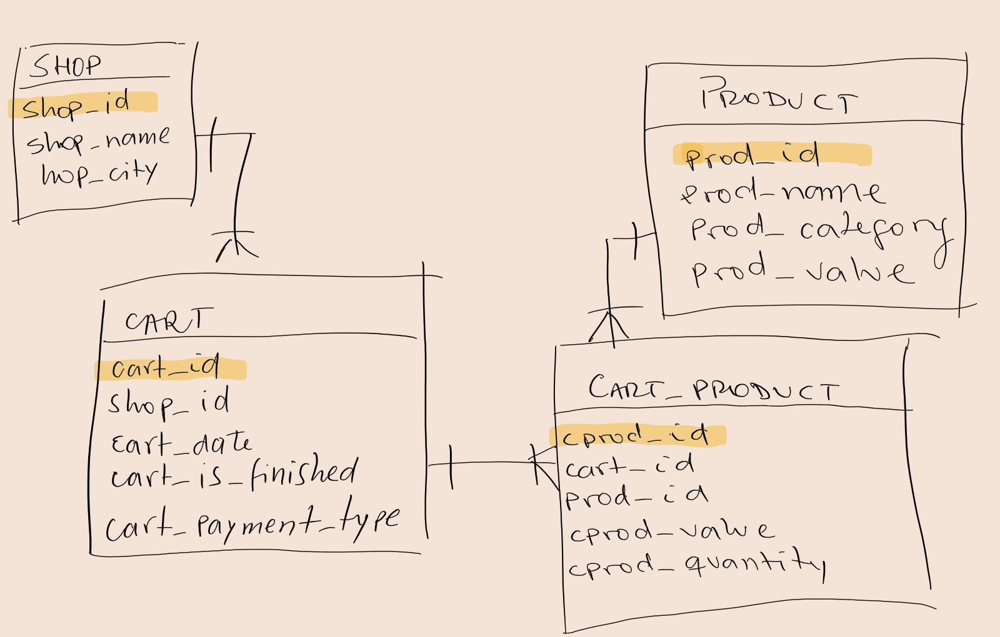

# 挑战 2

嘿，大家好！ 今天我们的首席财务官 (CFO) 希望我们向他提供一些有关我们销售业务的信息。
我们在卢克索、桑给巴尔、弗洛雷斯、库斯科、木尔坦、兖石、河内、比布鲁斯、阿尔戈斯、悉尼、雅典和普罗夫迪夫拥有 12 家商店组成的连锁品牌店。

他需要的信息是：
  - 每家商店每个工作日的总销售额
  - 每家商店的总销售额
  - 每个工作日销售额占商店总销售额的百分比
  - 每个工作日的整个连锁品牌店总销售额
  - 每家商店在每个工作日的销售额占整个连锁品牌店销售额的百分比
  - 整个连锁品牌店的总销售额
  - 每家店店占整个连锁品牌店总销售额的百分比
- Total sales per week-day on each shop
 - Total sales per shop
 - Percentage of the Weekly day sales on top of the Total Shop sales
 - Total sales per week-day on the whole Chain
 - Percentage of each store on the week-day sales of the whole Chain
 - Total sales of the whole Chain
 - Percentage of each Store on the total sales of the whole Chain


我知道这么说起来有点绕，让我举个例子便于更好理解：

假设整个连锁品牌店在此期间卖出了 355,000.00 美元：

```
  - 河内 总销售额: $170,000.00
  - 河内 周一 : $50,000.00 
  - 河内 周二: $75,000.00
  - 河内 周三: $45,000.00
  
  - 库斯科 总销售额: $185,000.00
  - 库斯科 周一 : $70,000.00
  - 库斯科 周二: $55,000.00
  - 库斯科 周三: $60,000.00
```

得到以下信息:
```
 - 每家商店每个工作日的总销售额
  - 周一: 
	- 河内: $50,000.00
	- 库斯科: $70,000.00
  - 周二:
	- 河内: $75,000.00
	- 库斯科: $55,000.00

 - 每家商店的总销售额
  - 河内: $170,000.00
  - 库斯科: $185,000.00

 - 每个工作日销售额占商店总销售额的百分比 
  - 河内: 
	- 周一: 29.41% (河内周一销售额 / 河内整个连锁店销售额)
	- 周二: 41.18% (河内周二销售额 / 河内整个连锁店销售额)
  - 库斯科: 
	- 周一: 40.54% (库斯科周一销售额 / 库斯科整个连锁店销售额)
	- 周二: 29.73% (库斯科周二销售额 / 库斯科整个连锁店销售额)

 - 每个工作日的整个连锁品牌店总销售额
  - 周一: $120,000.00
  - 周二: $130,000.00
  - 周三: $105,000.00

 - 每家商店在每个工作日的销售额占整个连锁品牌店销售额的百分比
  - 周一: 
	- 河内: 41.67%
	- 库斯科: 58.33%
  - 周二: $130,000.00
	- 河内: 57.69%
	- 库斯科: 42.31%

 - 整个连锁品牌店的总销售额：$355,000.00

 - 每家店店占整个连锁品牌店总销售额的百分比
  - 河内: 47.89%
  - 库斯科: 52.11%
```

好的，现在我们明白了我们想要得到什么，让我们看一下databae schema: 



如您所见，模式 (schma) 非常简单，只有 4 个表。主键突出显示。 此外，您将在下面的 SQL 脚本中看到表 `cart` 和 `cart_product` 有额外的索引，我希望它们有助于查询性能。

对了，忘记说一句，我们的 CFO 对 SQL 有一些基本的了解，他给我们发了一段他的 SQL 执行的结果：


```SQL
  shop_name | shop_city |  d_week   | t_weekly_by_shop |   t_shop    | perc_week_x_shop | t_weekly_general |   t_general   | perc_shop_week_x_week_general | perc_shop_x_general 
-----------+-----------+-----------+------------------+-------------+------------------+------------------+---------------+-------------------------------+---------------------
 Shop 1    | Luxor     | FRIDAY    |       6499577.15 | 46644819.86 |            13.93 |     146927880.11 | 1025839157.64 |                          4.42 |                4.55
 Shop 1    | Luxor     | MONDAY    |       6672388.54 | 46644819.86 |            14.30 |     145282068.65 | 1025839157.64 |                          4.59 |                4.55
 Shop 1    | Luxor     | SATURDAY  |       6882181.94 | 46644819.86 |            14.75 |     147276123.27 | 1025839157.64 |                          4.67 |                4.55
 Shop 1    | Luxor     | SUNDAY    |       6982777.87 | 46644819.86 |            14.97 |     145717543.03 | 1025839157.64 |                          4.79 |                4.55
 Shop 1    | Luxor     | THURSDAY  |       6511151.57 | 46644819.86 |            13.96 |     146282999.47 | 1025839157.64 |                          4.45 |                4.55
 Shop 1    | Luxor     | TUESDAY   |       6707777.95 | 46644819.86 |            14.38 |     149102323.67 | 1025839157.64 |                          4.50 |                4.55
 Shop 1    | Luxor     | WEDNESDAY |       6388964.84 | 46644819.86 |            13.70 |     145250219.44 | 1025839157.64 |                          4.40 |                4.55
 
 Shop 10   | Sydney    | FRIDAY    |      13236253.00 | 93203580.35 |            14.20 |     146927880.11 | 1025839157.64 |                          9.01 |                9.09
 Shop 10   | Sydney    | MONDAY    |      12734985.24 | 93203580.35 |            13.66 |     145282068.65 | 1025839157.64 |                          8.77 |                9.09
 Shop 10   | Sydney    | SATURDAY  |      13453324.00 | 93203580.35 |            14.43 |     147276123.27 | 1025839157.64 |                          9.13 |                9.09
 Shop 10   | Sydney    | SUNDAY    |      13433609.70 | 93203580.35 |            14.41 |     145717543.03 | 1025839157.64 |                          9.22 |                9.09
 Shop 10   | Sydney    | THURSDAY  |      13256231.13 | 93203580.35 |            14.22 |     146282999.47 | 1025839157.64 |                          9.06 |                9.09
 Shop 10   | Sydney    | TUESDAY   |      13635806.43 | 93203580.35 |            14.63 |     149102323.67 | 1025839157.64 |                          9.15 |                9.09
 Shop 10   | Sydney    | WEDNESDAY |      13453370.85 | 93203580.35 |            14.43 |     145250219.44 | 1025839157.64 |                          9.26 |                9.09
 
 Shop 11   | Athens    | FRIDAY    |      13495476.65 | 93384259.19 |            14.45 |     146927880.11 | 1025839157.64 |                          9.19 |                9.10
 Shop 11   | Athens    | MONDAY    |      13272581.16 | 93384259.19 |            14.21 |     145282068.65 | 1025839157.64 |                          9.14 |                9.10
 Shop 11   | Athens    | SATURDAY  |      13235762.96 | 93384259.19 |            14.17 |     147276123.27 | 1025839157.64 |                          8.99 |                9.10
 Shop 11   | Athens    | SUNDAY    |      13299859.03 | 93384259.19 |            14.24 |     145717543.03 | 1025839157.64 |                          9.13 |                9.10
 Shop 11   | Athens    | THURSDAY  |      13446303.70 | 93384259.19 |            14.40 |     146282999.47 | 1025839157.64 |                          9.19 |                9.10
 Shop 11   | Athens    | TUESDAY   |      13821932.39 | 93384259.19 |            14.80 |     149102323.67 | 1025839157.64 |                          9.27 |                9.10
 Shop 11   | Athens    | WEDNESDAY |      12812343.30 | 93384259.19 |            13.72 |     145250219.44 | 1025839157.64 |                          8.82 |                9.10
<...>
```
您看到了，这个查询里有他需要创建报告的所有数据。As you can see he has all the data we need to build the report in one single query.

挑战在于，您能否仅使用一个查询输出相同的结果？ 您是否能够仅使用我们手头的索引有效地做到这一点？

请在下面找到用于创建模式 (schma) 的 SQL：

```SQL
CREATE TABLE shop (
	shop_id INTEGER primary key,
	shop_name VARCHAR(100) NOT NULL,
	shop_city VARCHAR(30) NOT NULL
);

CREATE TABLE product (
	prod_id INTEGER primary key,
	prod_name VARCHAR(100) NOT NULL,
	prod_category VARCHAR(50) NOT NULL,
	prod_value DECIMAL(10,2) NOT NULL
);

CREATE TABLE cart (
	cart_id INTEGER primary key,
	shop_id INTEGER NOT NULL,
	cart_date TIMESTAMP WITHOUT TIME ZONE NOT NULL,
	cart_is_finished BOOLEAN NOT NULL,
	cart_payment_type VARCHAR(30) NOT NULL,
	CONSTRAINT fk_shop_cart FOREIGN KEY (shop_id) REFERENCES shop
);

CREATE TABLE cart_product (
	cprod_id INTEGER primary key,
	cart_id INTEGER NOT NULL,
	prod_id INTEGER NOT NULL,
	cprod_value DECIMAL(10,2) NOT NULL,
	cprod_quantity INTEGER NOT NULL,
	CONSTRAINT fk_cart_prod_cartID FOREIGN KEY (cart_id) REFERENCES cart,
	CONSTRAINT fk_cart_prod_prodID FOREIGN KEY (prod_id) REFERENCES product
);

INSERT INTO shop VALUES (1, 'Shop 1', 'Luxor');
INSERT INTO shop VALUES (2, 'Shop 2', 'Zanzibar');
INSERT INTO shop VALUES (3, 'Shop 3', 'Flores');
INSERT INTO shop VALUES (4, 'Shop 4', 'Cuzco');
INSERT INTO shop VALUES (5, 'Shop 5', 'Multan');
INSERT INTO shop VALUES (6, 'Shop 6', 'Yanshi');
INSERT INTO shop VALUES (7, 'Shop 7', 'Hanoi');
INSERT INTO shop VALUES (8, 'Shop 8', 'Byblos');
INSERT INTO shop VALUES (9, 'Shop 9', 'Argos');
INSERT INTO shop VALUES (10, 'Shop 10', 'Sydney');
INSERT INTO shop VALUES (11, 'Shop 11', 'Athens');
INSERT INTO shop VALUES (12, 'Shop 12', 'Plovdiv');

INSERT INTO product VALUES (1, 'Milk', 'Convenience Goods', 3.97);
INSERT INTO product VALUES (2, 'Shirt Blue', 'Shopping Goods', 19.78);
INSERT INTO product VALUES (3, 'Mobile Orange-X 5G 2022', 'Specialty Goods', 980.24);
INSERT INTO product VALUES (4, 'Fire Extinguisher X-DBA 1.0 DataFire', 'Unsought Goods', 23.98);
INSERT INTO product VALUES (5, 'Toothpaste', 'Convenience Goods',  4.13);
INSERT INTO product VALUES (6, 'Pants Red', 'Shopping Goods', 32.99);
INSERT INTO product VALUES (7, 'Tablet Penguins 17" OLED', 'Specialty Goods', 529.99);
INSERT INTO product VALUES (8, 'X-DBA Life Insurance DLeak', 'Unsought Goods', 483.69);
INSERT INTO product VALUES (9, 'Noodles', 'Convenience Goods', 1.86);
INSERT INTO product VALUES (10, 'Shoes My Brand Purple', 'Shopping Goods', 178.97);
INSERT INTO product VALUES (11, 'Mobile Seagull V.9.71 5G', 'Specialty Goods', 809.78);
INSERT INTO product VALUES (12, 'X-DBA Qry-Extended Life Battery 12v ', 'Unsought Goods', 365.42);
INSERT INTO product VALUES (13, 'Shampoo', 'Convenience Goods', 21.95);
INSERT INTO product VALUES (14, 'Shoes Your Brand Violet', 'Shopping Goods', 183.79);
INSERT INTO product VALUES (15, 'TV 4k WBears 120" HighView', 'Specialty Goods', 3499.99);
INSERT INTO product VALUES (16, 'X-DBA Life Insurance HA Always-ON Plus 3.2', 'Unsought Goods', 721.83);
INSERT INTO product VALUES (17, 'Soap', 'Convenience Goods', 4.72);
INSERT INTO product VALUES (18, 'Pants Yellow', 'Shopping Goods', 33.99);
INSERT INTO product VALUES (19, 'TV 1/2k MyPanda 32" awk-sed', 'Specialty Goods', 309.68);
INSERT INTO product VALUES (20, 'X-DBA Qry-Battery High Performance 9v', 'Unsought Goods', 7.99);

INSERT INTO cart
	SELECT x, 
		(random() * 11 + 1)::integer, 
		(now() - random() * (timestamp '2022-01-01 0:00:00' - timestamp '2021-01-01 0:00:00')), 
		(case when ((random() * 17)::int % 10)::int = 0 then false else true end)::boolean, (random() * 3)::text 
	FROM generate_series(1,500000) x;

WITH prod_ AS
(
	SELECT (random() * 19 + 1)::integer p_id, p_ctt FROM generate_series(1, 500000) p_ctt
) INSERT INTO cart_product (cprod_id, cart_id, prod_id, cprod_value, cprod_quantity)
	SELECT p_ctt,
		p_ctt,
		p.prod_id, 
		p.prod_value,
		case p_id
			when 3 then (random() * 1 + 1)::integer
			when 7 then (random() * 4 + 1)::integer
			when 11 then (random() * 2 + 1)::integer
			when 15 then 1
			else (random() * 9 + 1)::integer end as _quantity
	FROM prod_ JOIN product p ON p.prod_id = p_id;


WITH prod_ AS
(
	SELECT (random() * 19 + 1)::integer p_id, p_ctt FROM generate_series(500001, 1000000) p_ctt
) INSERT INTO cart_product (cprod_id, cart_id, prod_id, cprod_value, cprod_quantity)
	SELECT p_ctt,
		(random() * 499999 + 1)::integer, 
		p.prod_id, 
		p.prod_value,
		case p_id
			when 3 then (random() * 1 + 1)::integer
			when 7 then (random() * 4 + 1)::integer
			when 11 then (random() * 2 + 1)::integer
			when 15 then 1
			else (random() * 9 + 1)::integer end as _quantity
	FROM prod_ JOIN product p ON p.prod_id = p_id;

CREATE INDEX id_cart_shop_id ON cart(shop_id);
CREATE INDEX id_cart_product_cartId ON cart_product(cart_id);
CREATE INDEX id_cart_product_prodId ON cart_product(prod_id);
```